[;Hi,+我是大鹏+@KongValley;造点小工具,+偶尔写写+C++&font=Fira+Code&center=true&width=480&height=80&duration=2500&pause=800)](https://git.io/typing-svg)

## :computer: 关于我

## :hammer_and_wrench: 技术栈

## :bar_chart: 统计

## :snake: 贪吃蛇

<!-- ponytail: 全部图床均为本会话核验或现有 README 已证明可达的 host;不加分计数器/活动图(未要求) -->
